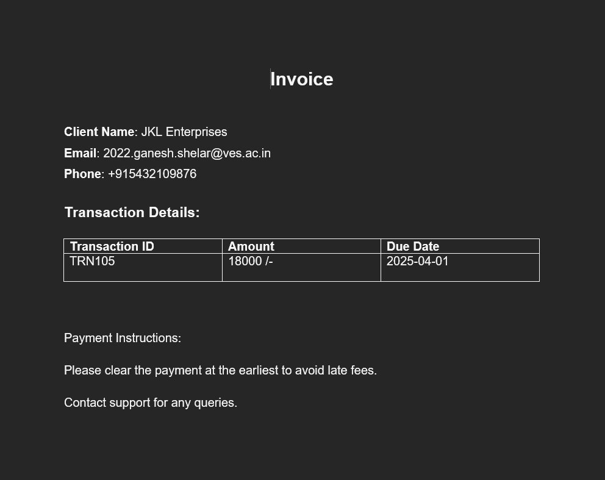
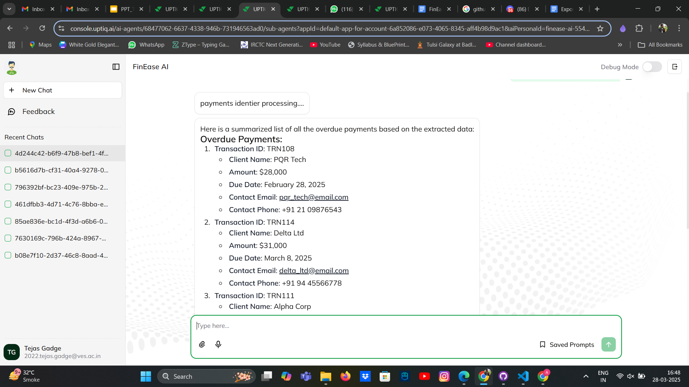

# FinEase: AI-Powered Autonomous Finance for Small Businesses

[Click here to visit the PPT](https://docs.google.com/presentation/d/1kdvpIaiRnVifQ3Nvl5Q3nInlcn0sYws7eab0fMHVgyc/edit?usp=sharing) 

[Click here for Detailed CookBook](https://docs.google.com/document/d/1RhQwJh2QUuCay4XJHj5Ikxv_0KUC-otH1cIRfd6ZkrA/edit?usp=sharing) 

---

## Table of Contents

- [Overview](#overview)
- [Features](#features)
- [Project Phases](#project-phases)
  - [Phase 1: Agent Creation Using Quick Create](#phase-1-agent-creation-using-quick-create)
  - [Phase 2: Subagent Creation](#phase-2-subagent-creation)
  - [Phase 3: Invoice Generation Implementation](#phase-3-invoice-generation-implementation)
  - [Phase 4: Overdue Detection Implementation](#phase-4-overdue-detection-implementation)
  - [Phase 5: Automated Reminder Notifications](#phase-5-automated-reminder-notifications)
  - [Phase 6: Cash Flow Analysis Implementation](#phase-6-cash-flow-analysis-implementation)
- [Key Components & Technologies](#key-components--technologies)

---

## Overview

FinEase is built to empower small businesses with a fully automated financial management solution. It streamlines the entire invoice lifecycle—from generation and tracking to overdue detection and cash flow analysis—using AI-driven insights. This reduces manual errors, speeds up processing, and ultimately helps businesses maintain a healthy cash flow.

---

## Features

- **Automated Invoice Tracking:**  
  Retrieves invoices from QuickBooks, Xero, Zoho Books, or emails; extracts key details using AI-powered OCR; and categorizes them as Paid, Due, or Overdue.

- **Group Users Retrieval (Overdue, Paid, and Unpaid):**  
  Automatically classifies invoices by payment status to enable targeted follow-ups and efficient cash flow management.

- **Automated Reminders (Email):**  
  Sends personalized email reminders based on invoice status, with escalation logic (Gentle, Urgent, Final Notice) to ensure timely payments.

- **Cash Flow Insights:**  
  Tracks income and expenses, generating real-time insights and forecasts to help businesses make informed financial decisions.

---

## Project Phases

### Phase 1: Agent Creation Using Quick Create

**Objective:**  
Create the main FinEase AI agent to streamline financial workflows.

**Steps:**
1. Log in to Uptiq AI Workbench and navigate to Agent Studio.
2. Select **Quick Create Agent**.
3. Enter the agent name: **FinEase AI**.
4. Provide a brief description:  
   *"AI-powered financial assistant that automates invoice management, overdue detection, cash flow analysis, and supplier payments for small businesses."*
5. Choose GPT-4 for financial insights.
6. Click **Create Agent**.

### Phase 2: Subagent Creation

**Objective:**  
Develop specialized subagents to handle specific financial tasks.

**Subagents & Responsibilities:**
- **Invoice Manager:** Generates invoices and stores invoice details.
- **Overdue Payment Detector:** Monitors invoice due dates, identifies overdue payments, and flags them.
- **Reminder Sender:** Sends payment reminders via email (and other channels) with escalation logic.
- **Cash Flow Analyzer:** Tracks income and expenses and generates cash flow insights.

**Configuration:**  
For each subagent, navigate to Agent Studio → Create New Subagent → Input the name, description, and assign responsibilities → Choose GPT-4 → Save.

**Intent & Subagents Diagram:**  

### Phase 3: Invoice Generation Implementation

**Objective:**  
Enable the Invoice Manager to automatically generate invoices based on financial transaction data.

**Steps:**
1. **Data Source Integration:**  
   Connect to QuickBooks, Zoho Books, or Vector DB using valid API keys to ensure access to transaction data.
2. **Invoice Generation Flow:**
   - **Trigger:** Detect a new transaction.
   - **Action:**  
     - Extract transaction details (amount, payer, date, etc.).
     - Generate an invoice with fields such as Invoice ID, Date of Issue, Due Date, Payer Information, Payment Terms, and Line Items.

4. **Testing:**  
   Create sample transactions and verify that invoices are generated automatically and stored correctly.

### Phase 4: Overdue Detection Implementation

**Steps:**
1. **Fetch Data:** Retrieve invoice records from the vector database.
2. **Classify & Organize:** Use AI to categorize invoices into Paid, Due, or Overdue.
3. **Trigger Actions:** Automatically send reminders for overdue invoices.

### Phase 5: Automated Reminder Notifications

**Steps:**
1. **Invoice Monitoring:** Continuously track due dates and payment statuses.
2. **User Retrieval:** Identify users with overdue or pending payments.
3. **Dispatch Reminders:** Automatically send personalized reminder emails at predefined intervals, with escalation if necessary.

### Phase 6: Cash Flow Analysis Implementation

**Part I: Income Tracking**
1. **Create Income Vector:** Establish an `income_store` in Uptiq by uploading a CSV dataset.
2. **Configure Workflow:** Analyze total income and customer payment details.

**Part II: Expense Tracking**
1. **Configure Workflow:** Track total expenses and map them to corresponding warehouse or vendor details.

**Part III: Cash Flow Insights**
1. **Process Financial Data:** Use AI to generate real-time cash flow insights and actionable strategies.

---

## Key Components & Technologies

- **AI Model:** GPT-4 for financial insights.
- **Uptiq AI Workbench:** For agent creation and workflow automation.
- **Vector DB:** For storing and tracking transaction data.
- **Notification APIs:** Twilio/Meta API for SMS, email, and WhatsApp reminders.
- **Payment Gateways:** Razorpay, PayPal, and Stripe for processing automated payments.
- **Accounting Integrations:** QuickBooks, Xero, Zoho Books.

---

# Made with ❤️ by Team INSPIRE
